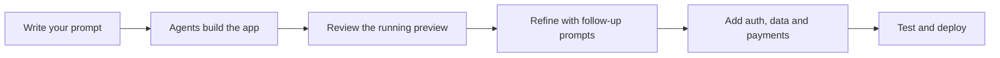

This Quickstart shows you **how to build an app with LaunchPulse**, from your first prompt to a working MVP. You describe the app in plain language, LaunchPulse builds the functional foundation, and you refine it until it is ready to test, deploy and share.

Unlike tools that only generate screens, LaunchPulse builds real backend logic, persistent data and authentication, so what you create here is software that runs.

<Info>
  **Key takeaways**

  - Build by describing your app in plain language, then refining with follow-up prompts.
  - The first build is a running app with real data and logic, not a mockup.
  - Strong prompts name the users, the core actions and the data the app stores.
  - Add authentication, storage, payments and AI services as your app grows.
  - Always run the testing agent before you deploy or share.
</Info>

## What you will build

By the end of this guide you will have a working app with a real data model, a usable interface and a clear path to add accounts, payments and AI features.

<CardGroup cols={2}>
  <Card title="Write a good prompt" icon="pen-nib" href="/write-a-good-prompt">
    The single biggest factor in build quality.
  </Card>

  <Card title="Manage your projects" icon="table-columns" href="/projects-dashboard">
    Revisit and manage every app you build.
  </Card>
</CardGroup>

## What do you need before you start?

You only need a clear idea and an account. Have these ready:

- A one-line description of what the app does
- The main type of user, for example admin, customer or team member
- The two or three core actions users must be able to take

<Note>
  You do not need wireframes, code or a chosen tech stack. LaunchPulse decides the structure and builds the foundation from your description.
</Note>

## How do you build your first app?

The flow is simple: prompt, review, refine, then ship.



<Steps>
  <Step title="Describe your app in a prompt">
    Open a new project and write what you want in plain language. Name the app, the users and the core workflow.

    ```text title="Example first prompt"
    A client portal where customers log in, submit support tickets and track ticket status.
    ```
  </Step>
  <Step title="Let the agents build the foundation">
    LaunchPulse [AI agents](/agents) generate the data model, backend logic and screens. The [autonomous AI software engineer](/autonomous-ai-software-engineer) assembles a working version, not a static mockup.
  </Step>
  <Step title="Review the running app">
    Open the preview and use it. Click through the core workflow to confirm the logic and data behave as expected.
  </Step>
  <Step title="Refine with follow-up prompts">
    Add, change or remove features by prompting one change at a time.

    ```text title="Example follow-up prompt"
    Add a priority field to tickets and sort the dashboard by priority.
    ```

    Use the [feature builder](/feature-builder) for larger additions.
  </Step>
  <Step title="Add real capabilities">
    Layer in [authentication](/authentication), [storage and databases](/storage-and-database), [AI services](/ai-services) and [payments](/payments-and-monetisation) as needed.
  </Step>
  <Step title="Test, deploy and share">
    Run the [testing agent](/testing-agent), then deploy on [LaunchPulse Cloud](/launchpulse-cloud) and optionally connect a [custom domain](/custom-domain).
  </Step>
</Steps>

## What does a good first prompt look like?

The clearer your prompt, the stronger the build. Compare these examples by app type.

<Tabs>
  <Tab title="Booking app">
    ```text
    A booking app where clients pick a service, choose a time slot and pay a deposit. Owners see all bookings on a calendar.
    ```
  </Tab>
  <Tab title="CRM">
    ```text
    A CRM where sales reps add leads, log calls and move deals through stages from new to won. Managers see a pipeline dashboard.
    ```
  </Tab>
  <Tab title="Internal tool">
    ```text
    An internal tool where staff submit expenses with a receipt photo and managers approve or reject them.
    ```
  </Tab>
</Tabs>

For a full guide, see [how to write a good prompt](/write-a-good-prompt).

## Quickstart checklist

<Check>
  Work through these before sharing your MVP.
</Check>

- Describe the app, the users and the core workflow
- Generate the first build and use the running preview
- Refine features with clear follow-up prompts
- Add authentication and persistent data
- Test the app with the testing agent
- Deploy to LaunchPulse Cloud

## Common mistakes to avoid

- **Vague prompts.** "Make a marketplace" gives the agents too little. Name the users and actions.
- **Skipping the test pass.** Always run the [testing agent](/testing-agent) before sharing.
- **Polishing UI before logic works.** Get the workflow and data right first, then refine design.
- **Adding everything at once.** Build the core workflow, confirm it works, then layer features.

<Tip>
  Treat building as a conversation. Each prompt should make one clear change so you can see its effect and stay in control of the result.
</Tip>

## Related documentation

- [What is LaunchPulse?](/what-is-launchpulse)
- [How to write a good prompt](/write-a-good-prompt)
- [Plan features with the feature builder](/feature-builder)
- [Build a SaaS MVP with AI](/build-a-saas-mvp)
- [Deploy on LaunchPulse Cloud](/launchpulse-cloud)
- [Fix common issues in troubleshooting](/troubleshooting)

## Frequently asked questions

<AccordionGroup>
  <Accordion title="How do I build an app with LaunchPulse?">
    Describe the app in a plain-language prompt, let the AI agents build a working foundation, refine features with follow-up prompts, add capabilities like authentication and payments, then test and deploy.
  </Accordion>

  <Accordion title="Do I need to know how to code?">
    No. You build by describing what you want. LaunchPulse handles the backend logic, data and structure, and you guide it through prompts.
  </Accordion>

  <Accordion title="How long does the first build take?">
    The first working version is generated automatically after your prompt. Most of your time goes into refining features and capabilities rather than setup.
  </Accordion>

  <Accordion title="Is the first build a real app or a mockup?">
    It is a real, running app with working logic and data, not a static mockup. You can use the preview and add accounts, payments and AI services as you go.
  </Accordion>

  <Accordion title="What should my first prompt include?">
    The app name, the main type of user and the two or three core actions users must be able to take. Specific actions produce stronger builds.
  </Accordion>

  <Accordion title="What do I do if the app is not what I expected?">
    Re-prompt with more specific roles, actions and data, and change one thing at a time. See [troubleshooting](/troubleshooting) for common fixes.
  </Accordion>

  <Accordion title="Can I build a mobile app in the Quickstart?">
    Yes. The same prompt-and-refine flow applies to mobile. See [build a mobile app MVP](/build-a-mobile-app-mvp) for mobile-specific guidance.
  </Accordion>
</AccordionGroup>

<Card title="Write your first prompt" icon="pen-nib" href="/write-a-good-prompt">
  The quality of your build starts with the prompt. Learn how to describe features clearly.
</Card>