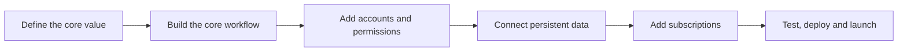

You can **build a SaaS MVP with AI** in LaunchPulse by describing your product in plain language and letting the agents assemble a working foundation: user accounts, persistent data, a dashboard and a path to subscription billing. The result is a real product you can launch and charge for, not a clickable prototype.

This page explains what a SaaS MVP needs, how LaunchPulse builds it and how to avoid the gaps that stall most early products.

<Info>
  **Key takeaways**

  - A launchable SaaS MVP needs accounts, persistent data, a dashboard and a billing path.
  - LaunchPulse builds these as real backend capabilities, so users can sign up and pay.
  - Build the core value first, then add auth, data and payments in focused prompts.
  - "Minimum viable" means cutting scope, not cutting the backend.
  - Deploy on LaunchPulse Cloud and connect a custom domain when you are ready to launch.
</Info>

## Why does LaunchPulse suit SaaS MVPs?

A SaaS product lives or dies on its backend: accounts, data, permissions and billing. LaunchPulse builds these as real, functional foundations, so your MVP can take signups and payments from day one rather than faking the parts that matter.

<CardGroup cols={2}>
  <Card title="Add authentication" icon="lock" href="/authentication">
    Sign-up, login and secure user accounts.
  </Card>

  <Card title="Set up the database" icon="database" href="/storage-and-database">
    Persistent data that survives every session.
  </Card>

  <Card title="Connect payments" icon="credit-card" href="/payments-and-monetisation">
    Stripe subscriptions and billing paths.
  </Card>

  <Card title="Deploy to the web" icon="cloud" href="/launchpulse-cloud">
    Ship your SaaS to a live URL.
  </Card>
</CardGroup>

## What does every SaaS MVP need?

A launchable SaaS MVP almost always includes these building blocks.

| Building block | Why it matters | LaunchPulse feature |
| --- | --- | --- |
| Sign-up and login | Know who the user is | [Authentication](/authentication) |
| Core workflow | Deliver the main value | Prompting and the [feature builder](/feature-builder) |
| Dashboard | Let users see their data | Built from your prompts |
| Persistent data | Nothing resets on reload | [Storage and database](/storage-and-database) |
| Billing | Charge for plans | [Payments and monetisation](/payments-and-monetisation) |
| Deployment | A shareable URL | [LaunchPulse Cloud](/launchpulse-cloud) |

## How do you build a SaaS MVP?



<Steps>
  <Step title="Define the core value">
    Describe the one job your SaaS does for users.

    ```text title="Starting prompt"
    A scheduling SaaS where coaches set their availability and clients book and pay for sessions.
    ```
  </Step>
  <Step title="Build the core workflow first">
    Prompt the main flow end to end before adding extras. Use the [feature builder](/feature-builder) for larger pieces.
  </Step>
  <Step title="Add accounts and permissions">
    Layer in [authentication](/authentication) so each user has a secure account and sees only their data.
  </Step>
  <Step title="Connect persistent data">
    Use [storage and the database](/storage-and-database) so user records, settings and history persist.
  </Step>
  <Step title="Add subscriptions">
    Connect [payments and monetisation](/payments-and-monetisation) to charge for plans with Stripe.
  </Step>
  <Step title="Test, deploy and refine">
    Run the [testing agent](/testing-agent), deploy on [LaunchPulse Cloud](/launchpulse-cloud) and connect a [custom domain](/custom-domain).
  </Step>
</Steps>

## SaaS MVP launch checklist

<Check>
  Confirm each item before you open signups.
</Check>

- Core workflow works end to end
- Users can sign up and log in securely
- Data persists and is scoped to each user
- A dashboard shows users their own data
- At least one paid plan is connected
- The app is deployed to a live URL
- The build has passed a test pass

## What are the common mistakes when building a SaaS MVP?

- **Faking the backend.** A demo with no real data or accounts cannot onboard real users. Build these first.
- **Too many features at launch.** Ship the core value, then expand. An MVP is the smallest thing people will pay for.
- **No billing path.** A SaaS without a way to charge is hard to validate. Add payments early.
- **Skipping permissions.** Users must only see their own data. Define roles in your prompts.
- **Polishing UI before logic.** Refine design after the workflow and data are solid.

<Warning>
  "MVP" means minimum viable, not minimum visible. Cut scope, not the backend. The parts that make it viable, accounts, data and billing, are the parts to keep.
</Warning>

## When should you use this approach?

Build a SaaS MVP with LaunchPulse when you want to validate a paid product quickly without assembling a full engineering stack, and when you need real users to sign up, use the product and pay, not just click through a demo.

## Key terms

<Expandable title="SaaS terms used on this page">
  - **SaaS** — software as a service: an app users access online, usually on a subscription.
  - **MVP** — minimum viable product: the smallest version that delivers real, payable value.
  - **Subscription billing** — recurring charges for a plan, handled here through Stripe.
  - **Per-user data scoping** — restricting records so each user sees only their own data.
</Expandable>

## Related documentation

- [What is LaunchPulse?](/what-is-launchpulse)
- [Quickstart: build your first app](/quickstart)
- [How to write a good prompt](/write-a-good-prompt)
- [Add authentication](/authentication)
- [Set up storage and database](/storage-and-database)
- [Connect payments and monetisation](/payments-and-monetisation)
- [Deploy on LaunchPulse Cloud](/launchpulse-cloud)

## Frequently asked questions

<AccordionGroup>
  <Accordion title="Can I really build a SaaS MVP with AI?">
    Yes. LaunchPulse builds the real foundations a SaaS needs, including authentication, persistent data, dashboards and subscription payments, from your plain-language prompts.
  </Accordion>

  <Accordion title="Does the MVP support payments and subscriptions?">
    Yes. You can connect Stripe-based payments and subscription billing so your MVP can charge users for plans. See [payments and monetisation](/payments-and-monetisation).
  </Accordion>

  <Accordion title="Is this a prototype or a real product?">
    It is a real, functional product. LaunchPulse builds working backend logic and data rather than a static prototype, so you can onboard real users.
  </Accordion>

  <Accordion title="What should my SaaS MVP include at launch?">
    A working core workflow, secure sign-up and login, persistent data scoped to each user, a dashboard, at least one paid plan and a deployed URL.
  </Accordion>

  <Accordion title="How do I deploy my SaaS MVP?">
    Deploy on [LaunchPulse Cloud](/launchpulse-cloud) to get a live URL, then optionally connect a [custom domain](/custom-domain) for your brand.
  </Accordion>

  <Accordion title="How small should my first version be?">
    As small as possible while still delivering real value. Build the single workflow people would pay for, then expand based on user feedback.
  </Accordion>

  <Accordion title="Can multiple users have separate data?">
    Yes. Combine authentication with the database to scope records per user, so each account only sees its own data.
  </Accordion>
</AccordionGroup>

<Card title="Set up payments for your SaaS" icon="credit-card" href="/payments-and-monetisation">
  Turn your MVP into a paid product. Connect subscriptions and billing.
</Card>