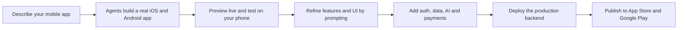
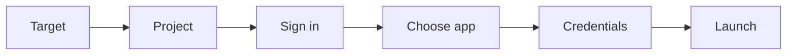

You can **build a mobile app MVP with AI** in LaunchPulse by describing your app in plain language and letting the AI agents build a real, working iOS and Android app: native screens, persistent data, authentication, in-app purchases and a backend that runs in production. LaunchPulse builds your app through Expo, previews it live on a real device with Expo Go, and publishes it to the App Store and Google Play from one workflow.

This is not a prototype or a clickable mockup. It is a functional mobile app with the backend, accounts, payments and deployment path a real product needs, which is why mobile is where LaunchPulse is strongest.

<Info>
  **Key takeaways**

  - LaunchPulse turns plain-language prompts into real iOS and Android apps, not screen mockups.
  - Apps are built through Expo (a React Native framework) and previewed live on your phone with Expo Go.
  - You get a real backend, authentication, persistent storage, AI services and in-app purchases.
  - In-app subscriptions are handled through RevenueCat, with App Store Connect and Google Play sync.
  - You can publish to the App Store and Google Play through a guided, six-step launch flow.
  - The differentiator versus vibe-coding tools is a working app foundation first, visual polish second.
</Info>

<CardGroup cols={2}>
  <Card title="Start your first app" icon="bolt" href="/quickstart">
    Go from prompt to a running app in the Quickstart.
  </Card>

  <Card title="Write a strong prompt" icon="pen-nib" href="/write-a-good-prompt">
    The single biggest factor in mobile build quality.
  </Card>

  <Card title="Add in-app payments" icon="credit-card" href="/payments-and-monetisation">
    Set up subscriptions and in-app purchases.
  </Card>

  <Card title="Publish to the stores" icon="rocket" href="/publishing-to-app-store-and-play-store">
    Ship to the App Store and Google Play.
  </Card>
</CardGroup>

## What is a mobile app MVP?

A mobile app MVP is the smallest working version of an iOS or Android app that delivers real value to users. It includes the core workflow, real data and the native features your app depends on, but leaves out everything that is not essential for a first release.

The goal of an MVP is to validate the idea with real users on real devices, not to build every feature. A good mobile MVP can be downloaded, used, and improved based on feedback.

LaunchPulse is built for this. It produces a functional mobile app you can test on your own phone, hand to early users, and submit to the stores, then expand feature by feature through prompts.

## What kinds of mobile apps can you build?

LaunchPulse is a general-purpose **AI mobile app builder** for functional apps across categories. Common examples include:

- Fitness, habit and wellness trackers with progress history
- AI assistants and coaching apps that use language models
- Social and community apps with profiles, posts and feeds
- Booking and scheduling apps with payments and reminders
- Marketplaces and on-demand apps with listings and orders
- Productivity, notes and workflow apps with offline support
- Subscription content apps with paywalls and member areas

<Tabs>
  <Tab title="AI coaching app">
    An app where users start a practice session, get an AI-generated score and receive coaching tips. Built with [AI services](/ai-services) and real session history.
  </Tab>
  <Tab title="Fitness tracker">
    An app where users log workouts, see weekly progress and set goals, with data that persists per user through [storage and the database](/storage-and-database).
  </Tab>
  <Tab title="Booking app">
    An app where customers pick a service, choose a time slot and pay, with [authentication](/authentication) and [in-app payments](/payments-and-monetisation).
  </Tab>
  <Tab title="Subscription content">
    An app with a free tier and a paid membership behind a paywall, using RevenueCat subscriptions through [payments and monetisation](/payments-and-monetisation).
  </Tab>
</Tabs>

## Why is LaunchPulse strong for mobile app development?

Most AI app builders stop at a good-looking screen. A mobile app that ships needs far more: a real backend, secure accounts, persistent data, native device features, in-app billing and a path through Apple and Google review. LaunchPulse builds these as real capabilities, then gives you the tools to test on a real device and publish.

The difference is the foundation. You can always refine the interface through prompts. The hard parts, the backend and the store pipeline, are what LaunchPulse handles for you.

| Capability | Vibe-coding / prototype tools | Native dev from scratch | LaunchPulse |
| --- | --- | --- | --- |
| Output | Screens and demos | Full custom app | Real iOS and Android MVP |
| Time to first build | Fast | Slow | Fast |
| Backend and data | Faked or absent | You build it | Built for you |
| Authentication | Login screen only | You build it | Real accounts |
| In-app purchases | Visual only | Complex setup | RevenueCat integration |
| Device testing | Limited | Full | Live preview on your phone |
| Store publishing | Not supported | Manual and involved | Guided six-step flow |
| Skill required | Low | High | Low to medium |

## What tools do you get in the LaunchPulse workspace?

When you build a mobile app, the LaunchPulse workspace gives you everything in one place: a chat-driven build agent, a live preview, project services and a publish pipeline. Here is what each part does.

| Area | What it does |
| --- | --- |
| Auto Build and Agent modes | Choose fast automated edits, or an agent that plans, builds and iterates |
| AI model selector | Choose the model that builds your app, across Claude, GPT and Qwen |
| MCP servers | Give the agent extra tools and data sources during iterations |
| Live Preview | See your app update as you build |
| Simulate on Web, iOS, Android | Preview your app as each platform renders it |
| Try on device | Open the app on your real phone with Expo Go and a QR code |
| Users | Manage authenticated users and accounts |
| AI | Configure AI services and track AI credits and usage |
| Secrets | Store API keys and environment secrets securely |
| Domains | Connect custom domains for web targets and links |
| Payments | Configure RevenueCat in-app purchases and store subscription sync |
| Storage | Store files and uploads |
| Database | Hold persistent records and relationships |
| Test GitHub and Restore GitHub | Save and restore versions of your project |
| Publish iOS and Publish Android | Launch to the App Store and Google Play |
| Code view | Inspect the underlying code |

<Note>
  You do not need to use every tool to ship an MVP. Start with the build agent and preview, then add accounts, data, payments and publishing as your app grows.
</Note>

## How do you build a mobile app MVP with AI?

The flow is the same for every app: describe it, let the agents build, preview it on a real device, add capabilities, then publish. You stay in control by changing one thing at a time.



<Steps>
  <Step title="Describe your app in a prompt">
    Open a new project and describe the app, the users and the core workflow in plain language. Name the native features you need, such as the camera, push notifications or offline support.

    ```text title="Example first prompt"
    A mobile habit tracker where users create habits, check them off daily, see a streak, and get a reminder notification each morning.
    ```

    For a full guide, see [how to write a good prompt](/write-a-good-prompt).
  </Step>
  <Step title="Let the agents build the app">
    Choose Agent mode and a model, then let LaunchPulse build a working iOS and Android app with backend logic, a data model and native screens. Learn how the [AI agents](/agents) and the [autonomous AI software engineer](/autonomous-ai-software-engineer) work.
  </Step>
  <Step title="Preview the app live">
    Use Live Preview to watch the app build, and switch between Simulate on Web, iOS and Android to see how each platform renders your screens.
  </Step>
  <Step title="Test on your real device">
    Select Try on device, install Expo Go, and scan the QR code to open your app on your phone. This is where you test real touch gestures and native features.
  </Step>
  <Step title="Refine with follow-up prompts">
    Add, change and polish features one prompt at a time. Use the quick actions such as Audit the mobile UX, Polish a screen and Build the next feature, or the [feature builder](/feature-builder) for larger additions.

    ```text title="Example follow-up prompt"
    Add a profile screen with the user's name, current streak and total habits completed.
    ```
  </Step>
  <Step title="Add real capabilities">
    Layer in [authentication](/authentication), [storage and the database](/storage-and-database), [AI services](/ai-services) and [in-app payments](/payments-and-monetisation) as your MVP grows.
  </Step>
  <Step title="Deploy the backend and publish">
    Deploy the production backend, then use the guided launch flow to publish to [the App Store and Google Play](/publishing-to-app-store-and-play-store).
  </Step>
</Steps>

## Auto Build vs Agent mode: which should you use?

LaunchPulse offers two ways to build. You can switch between them at any time from the build panel.

<Tabs>
  <Tab title="Auto Build">
    Auto Build applies focused changes quickly. Use it for small, well-defined edits, such as changing a label, adjusting a layout or fixing one screen. It is fast and direct.
  </Tab>
  <Tab title="Agent">
    Agent mode plans, builds and iterates on larger work. Use it to build a new feature end to end, wire up a workflow, or make changes that touch multiple screens and the backend together. The agent can also use MCP servers and run a review and test pass.
  </Tab>
</Tabs>

<Tip>
  A simple rule: use Agent mode to build features and Auto Build to tweak them. Start most new work in Agent mode, then switch to Auto Build for quick polish.
</Tip>

## Which AI model should you choose?

LaunchPulse lets you choose the AI model that builds your app from the model selector, and you can switch models at any time. The model interprets your prompt and generates the app, so model choice affects build quality, speed and cost. You are not locked to one provider: LaunchPulse offers a choice of frontier models from Anthropic, OpenAI and Qwen.

Available models include the following. The exact lineup changes over time as new models are added, so treat this as a snapshot of the families you can pick from.

| Model family | Examples in the selector | Best for |
| --- | --- | --- |
| Claude Opus | Claude Opus 4.8, Opus 4.6, Opus 4.5 | The most capable builds: large features, complex logic and tricky refactors |
| Claude Sonnet | Claude Sonnet 4.6, Sonnet 4.5 | A fast, balanced default for everyday building and iteration |
| OpenAI GPT | GPT 5.5 | An alternative provider for general building and a different model style |
| Qwen | Qwen 3.6 Plus | A further option when you want to compare results across providers |

A practical approach is to use a Sonnet-class model as your default for speed, switch to an Opus-class model for the hardest features or when a build needs more reasoning, and try a different provider if you want a second take on a tricky screen or workflow.

<Tip>
  Model choice is not permanent. If a build is not coming out right, switch models and re-prompt. A more capable model often resolves complex features that a faster model struggles with.
</Tip>

Your AI usage is tracked in the AI section as AI Credits and Usage, where you can see your current balance, total spent and usage history. For details on plans and credits, see [accounts and subscriptions](/accounts-and-subscriptions).

## How do you preview and test a mobile app?

Testing on a real device is essential for mobile, because touch, gestures and native features behave differently from a browser. LaunchPulse gives you three layers of preview.

<Steps>
  <Step title="Live Preview in the browser">
    Watch your app update as the agent builds. This is the fastest way to see changes.
  </Step>
  <Step title="Platform simulation">
    Switch between Simulate on Web, Simulate on iOS and Simulate on Android to check how each platform renders your screens and components.
  </Step>
  <Step title="Try on device with Expo Go">
    Download Expo Go (a free app, with no app-store build needed) and scan the QR code from Try on device to open your app on your real phone. Test gestures, scrolling and native features here.
  </Step>
</Steps>

<Note>
  To see new changes on your device while testing, shake your phone, open the Expo Go menu, then tap Reload. This refreshes the running preview with your latest build.
</Note>

## How do users and authentication work on mobile?

Most mobile apps need to know who the user is, so they can save data, personalise the experience and gate paid features. LaunchPulse builds real [authentication](/authentication), and you manage accounts from the Users section of your project.

- Secure sign-up and login for app users
- Per-user data, so each person sees only their own records
- Roles and permissions, such as standard user versus admin
- A foundation for subscriptions and member-only areas

```text title="Auth prompt"
Add sign-up and login so each user has their own habits, streaks and profile.
```

## How does data and storage work?

A real app remembers what users create. LaunchPulse gives every app persistent data through the Database and file uploads through Storage.

- Database holds your records, such as habits, sessions, bookings or posts, and the relationships between them
- Storage holds uploaded files, such as profile photos, images and documents
- Data is scoped to each authenticated user for privacy

Learn more in [storage and the database](/storage-and-database).

```text title="Data prompt"
Each habit has a name, an icon, a daily check-in history and a current streak, and belongs to one user.
```

## How do you add AI features to a mobile app?

LaunchPulse apps can use AI for chat, coaching, summarisation, search and content generation. You configure these in the AI section, and your app's AI usage is metered through AI Credits and Usage.

Common mobile AI features include:

- An AI assistant or chatbot inside the app
- AI-generated tips, summaries or recommendations
- Smart search over the user's data
- Content generation from a prompt or template

See [AI services](/ai-services) for the full set of options.

```text title="AI feature prompt"
After each practice session, generate three personalised coaching tips based on the user's scores.
```

## How do you store API keys and secrets?

Mobile apps often need third-party API keys, for AI providers, maps, analytics and more. Store these securely in the Secrets section rather than hard-coding them, and reference them from your app. For LaunchPulse's own API access, see [API keys](/api-key).

## Can you connect custom domains?

Yes. Use the Domains section to connect a [custom domain](/custom-domain), which is useful for web targets, marketing pages, deep links and shared links that point back into your app experience.

## Can the agent use external tools through MCP?

Yes. LaunchPulse supports Model Context Protocol (MCP) servers, which give the build agent extra tools and data sources to use during iterations. You add a server with a name, a URL and an optional headers JSON value, such as an Authorization bearer token, and remote servers can use a custom header or OAuth.

This is useful when you want the agent to work with your own services, internal data or a tool like an issue tracker while it builds. Learn more about extending agents in [custom agents](/custom-agents) and [AI multi-agent mode](/ai-multi-agent-mode).

## How do you save and restore versions?

LaunchPulse integrates with GitHub so you can save and restore your project. Use Test GitHub to push and validate the current state, and Restore GitHub to roll back to a previous version if a change does not work out. This gives you a safety net while you iterate quickly.

## Can you access the underlying code?

Yes. The Code view lets you inspect the underlying code of your app. You build by prompting, but the generated code is there when you want to review it, which is helpful for understanding behaviour and for handing the project to a developer later.

## How do in-app purchases and subscriptions work?

Mobile monetisation runs through in-app purchases, and LaunchPulse handles this with RevenueCat, configured in the Payments section. RevenueCat manages subscriptions and in-app purchases across both iOS and Android, so you do not have to wire each store's billing separately.

There are two ways to connect, plus a sync step for App Store subscriptions.

<Steps>
  <Step title="Connect with RevenueCat (recommended)">
    Connect your RevenueCat account via OAuth. LaunchPulse creates or reuses the RevenueCat project, adds your iOS and Android apps, and saves the platform SDK keys, plus the Test Store key when RevenueCat provides it.
  </Step>
  <Step title="Or enter API keys manually">
    If you prefer, you can enter your RevenueCat API keys manually. This is the advanced path for teams that already manage their own keys.
  </Step>
  <Step title="Sync App Store subscription products">
    Add an App Store Connect API key so LaunchPulse can create matching App Store subscription products. Create the key in App Store Connect under Users and Access, then Integrations, then App Store Connect API, and paste the key ID, issuer ID and .p8 private key. Then sync a RevenueCat subscription using the same Product ID to create the matching subscription and initial price in App Store Connect.
  </Step>
</Steps>

<Info>
  Use a single source of truth for product IDs. Create the product in RevenueCat, then sync it to the stores using the same Product ID, so your subscriptions line up across RevenueCat, App Store Connect and Google Play.
</Info>

For the full monetisation guide, including web payments and SaaS billing, see [payments and monetisation](/payments-and-monetisation).

## How do you publish a mobile app to the App Store and Play Store?

LaunchPulse includes a guided launch flow, currently in Beta, that takes you from a finished build to a submitted app. You can target one or both storefronts. LaunchPulse keeps the same backend flow, builds through Expo, and submits using the credentials you provide.

The flow has six stages.



<Steps>
  <Step title="Target: choose your storefronts">
    Choose to publish to the App Store, Google Play, or both. You can ship iOS to TestFlight or App Store Connect, and Android to the release track you choose.
  </Step>
  <Step title="Project: confirm the Expo project">
    Confirm the Expo project that your app builds through. This is the project EAS uses to produce your store builds.
  </Step>
  <Step title="Sign in: connect developer access">
    Connect your developer accounts so LaunchPulse can build and submit on your behalf. EAS configures the signing certificates for you.
  </Step>
  <Step title="Choose app: create or reuse app IDs">
    Create new app IDs or reuse existing ones. On iOS this is your bundle ID; on Android this is your package name.
  </Step>
  <Step title="Credentials: prepare certificates and keys">
    Provide the credentials each store needs. For iOS, that is an Apple ID password or an App Store Connect API key. For Android, that is a Google Play service account JSON upload.
  </Step>
  <Step title="Launch: build, submit and monitor">
    Start the build and submission, then monitor progress. Generated Android build downloads appear in the publish progress, and you can submit for review when ready.
  </Step>
</Steps>

<Warning>
  Deploy your production backend first. Apple and Google sign-in and any backend features only work once the production backend is ready, so deploy it before you launch to the stores. The launch flow makes no changes until you start the publish flow.
</Warning>

### Publishing to the App Store (iOS)

To ship an iOS build to TestFlight or App Store Connect, prepare:

- A bundle ID and app name for your iOS release
- An Apple ID password or an App Store Connect API key
- Optional review submission with metadata and screenshots

Use TestFlight to test with real users before submitting for App Store review. For polished store screenshots, see the [app screenshot generator](/screenshots-mobile-app).

### Publishing to Google Play (Android)

To publish an Android build, prepare:

- A package name and a release track selection
- A Google Play service account JSON upload
- Store listing assets for your release

Generated Android build downloads appear in the publish progress so you can verify the build. The full store submission walkthrough lives in [publishing to the App Store and Play Store](/publishing-to-app-store-and-play-store).

### Deploying the production backend

Your mobile app talks to a production backend. Deploy this backend before launching, so authentication and backend features are live when users open the app. This sequencing matters: store sign-in flows depend on the backend being ready first.

## Example: building a mobile app step by step

Here is how a typical first build comes together, using an AI coaching app as an example. The same pattern works for any category.

<Steps>
  <Step title="Describe the core app">
    ```text
    A mobile app where users start a practice session, receive an AI score out of 100, and see coaching tips. Show recent sessions on the home screen.
    ```
  </Step>
  <Step title="Preview and test on device">
    Open Live Preview, switch to Simulate on iOS, then scan the QR code in Try on device to use it on your phone.
  </Step>
  <Step title="Add accounts and data">
    ```text
    Add login so each user has their own sessions and scores, and store every session with its date, score and tips.
    ```
  </Step>
  <Step title="Add an AI feature">
    ```text
    After each session, generate three personalised coaching tips based on the user's score for confidence, eye contact, speaking and body language.
    ```
  </Step>
  <Step title="Add a subscription">
    ```text
    Add a Pro subscription that unlocks unlimited sessions and detailed analytics, with a paywall on the analytics screen.
    ```

    Then connect RevenueCat in Payments to power the subscription.
  </Step>
  <Step title="Polish, deploy and publish">
    Use Polish a screen to refine the UI, deploy the production backend, then publish to the App Store and Google Play.
  </Step>
</Steps>

## Mobile app prompt library

Copy these prompts and adapt them to your app. Build the core first, then add capabilities one at a time.

<Tabs>
  <Tab title="Core app">
    ```text
    A [app type] where [user] can [action], [action] and [action]. Show [main screen] on the home tab.
    ```
  </Tab>
  <Tab title="Native features">
    ```text
    Add a camera screen so users can take or upload a photo and attach it to a [record].
    ```
  </Tab>
  <Tab title="Push notifications">
    ```text
    Send a reminder notification each day at a time the user picks in settings.
    ```
  </Tab>
  <Tab title="Offline support">
    ```text
    Let users view and add [records] while offline, then sync when they reconnect.
    ```
  </Tab>
  <Tab title="Paywall">
    ```text
    Add a paid tier that unlocks [premium feature], with a paywall screen and a restore purchases option.
    ```
  </Tab>
</Tabs>

## How do you decide what to build first?

The hardest part of an MVP is choosing what to leave out. A good rule is to build only what proves your core idea, and defer everything else to a later release. Use this split as a starting point.

| Build now (MVP) | Add later |
| --- | --- |
| The single core workflow | Secondary workflows and edge cases |
| Sign-up and login | Social login and advanced roles |
| Persistent data for the core feature | Analytics dashboards and exports |
| One paid tier, if you are charging | Multiple plans and promotions |
| The two or three key screens | Settings depth and customisation |
| One or two native features you depend on | Nice-to-have native integrations |

If you are still validating the idea itself, [find winning mobile app ideas](/ai-apps-discovery) first, then scope the smallest version that tests it. For planning larger features once the core works, use the [feature builder](/feature-builder).

<Tip>
  Ask one question for every feature: does the app prove its value without this? If yes, defer it. An MVP is a test, not a final product.
</Tip>

## What is the roadmap from idea to launch?

A typical mobile MVP moves through five phases. You can complete the early phases quickly and spend most of your time refining the build and preparing for the stores.

<Steps>
  <Step title="Phase 1: Define and scope">
    Write a clear description of the app, the core workflow and the must-have native features. Cut anything that is not essential for a first release.
  </Step>
  <Step title="Phase 2: Build the core">
    Use Agent mode to build the core workflow end to end, then preview it and test it on your phone with Try on device.
  </Step>
  <Step title="Phase 3: Add foundations">
    Layer in [authentication](/authentication), [persistent data](/storage-and-database), and any [AI services](/ai-services) the app needs, scoping data to each user.
  </Step>
  <Step title="Phase 4: Monetise and polish">
    Connect [in-app purchases](/payments-and-monetisation) if you are charging, then polish screens and run the [testing agent](/testing-agent).
  </Step>
  <Step title="Phase 5: Deploy and publish">
    Deploy the production backend, prepare store assets, and use the [guided launch flow](/publishing-to-app-store-and-play-store) to submit to the App Store and Google Play.
  </Step>
</Steps>

## Can you build a web version of the same app?

Yes. LaunchPulse supports both web and mobile, so you can build a web app alongside your mobile app and share the same backend. This is useful when you want a marketing site, an admin dashboard or a browser version of your product. See [AI web app development](/web-app-development) and deploy web targets on [LaunchPulse Cloud](/launchpulse-cloud), optionally with a [custom domain](/custom-domain).

## Best practices for building a mobile app MVP

- Build the core workflow first, then add accounts, data, payments and polish.
- Test on a real device early and often, not just in the browser simulator.
- Name the native features you need in your prompt, such as camera, notifications or offline.
- Keep your first release focused. Ship the smallest version users would value.
- Scope data to each user from the start so privacy is built in, not retrofitted.
- Use Agent mode to build features and Auto Build to refine them.
- Save versions with GitHub before large changes so you can restore if needed.
- Deploy the production backend before publishing so store sign-in works on launch.

<Check>
  Run the [testing agent](/testing-agent) before every release to catch issues across screens and flows.
</Check>

## Common mistakes to avoid

- **Only testing in the browser.** Touch, gestures and native features behave differently on a device. Use Try on device.
- **Adding everything at once.** Cramming many features into one prompt makes results hard to control. Build incrementally.
- **Polishing the UI before the logic works.** Get the workflow and data right first, then refine design.
- **Forgetting the backend before launch.** Publishing without deploying the production backend breaks sign-in and backend features.
- **Mismatched product IDs.** Create the product once in RevenueCat and sync the same Product ID to the stores.
- **Skipping store assets.** App review needs metadata, icons and screenshots. Prepare these before you submit.
- **Hard-coding API keys.** Store keys in Secrets rather than in the app.

## When should you use LaunchPulse for mobile?

LaunchPulse is the right choice when you want to:

- Validate a mobile app idea quickly with real users on real devices
- Ship a functional iOS and Android MVP without a full mobile engineering team
- Get a real backend, accounts, data and in-app purchases, not just screens
- Move from idea to a store submission in one connected workflow

If you only need a static marketing page or a single design mockup, a dedicated design tool may be faster. Reach for LaunchPulse when the app has to work, store data and run on real phones.

## Do mobile apps support native device features?

Yes. Because LaunchPulse apps run through Expo on a real device, you can build and test native features and touch interactions. Common native capabilities include the camera and photo library, push notifications, location, offline storage and gestures. Describe the feature you want in a prompt, then verify it on your phone with Try on device.

## Pre-launch checklist

Work through these before you submit to either store.

<AccordionGroup>
  <Accordion title="App readiness">
    - Core workflow works end to end on a real device
    - Sign-up, login and account recovery work
    - Data persists per user and nothing resets on reload
    - Paid features and the paywall behave correctly
    - The production backend is deployed
    - The build has passed a test pass
  </Accordion>

  <Accordion title="iOS (App Store) readiness">
    - Bundle ID and app name are set
    - An Apple ID password or App Store Connect API key is ready
    - App icons and screenshots are prepared
    - Store metadata and description are written
    - A TestFlight build has been tested with real users
  </Accordion>

  <Accordion title="Android (Google Play) readiness">
    - Package name is set
    - A release track is chosen
    - A Google Play service account JSON is uploaded
    - Store listing assets and screenshots are prepared
    - The generated build has been verified in publish progress
  </Accordion>
</AccordionGroup>

## Key terms

<Expandable title="Mobile and publishing terms used on this page">
  - **MVP** — minimum viable product: the smallest working version of an app that delivers real value.
  - **Expo** — a React Native framework that LaunchPulse builds your mobile app through.
  - **EAS** — Expo Application Services, which builds your app and configures signing certificates.
  - **Expo Go** — a free app used to preview your build live on a real device, with no app-store build required.
  - **RevenueCat** — the service that manages in-app subscriptions and purchases across iOS and Android.
  - **App Store Connect** — Apple's portal for managing iOS apps, builds and subscriptions.
  - **TestFlight** — Apple's service for testing iOS builds with real users before release.
  - **Bundle ID** — the unique identifier for an iOS app.
  - **Package name** — the unique identifier for an Android app.
  - **Release track** — the Google Play channel you publish to, such as internal, testing or production.
  - **Service account JSON** — the Google Play credential that lets LaunchPulse submit Android builds.
  - **Production backend** — the live backend your published app talks to, deployed before launch.
</Expandable>

## Related documentation

- [What is LaunchPulse?](/what-is-launchpulse)
- [Quickstart: build your first app](/quickstart)
- [How to write a good prompt](/write-a-good-prompt)
- [AI mobile app development](/mobile-app-development)
- [Publish to the App Store and Play Store](/publishing-to-app-store-and-play-store)
- [App screenshot generator](/screenshots-mobile-app)
- [Add authentication](/authentication)
- [Set up storage and database](/storage-and-database)
- [Add AI services](/ai-services)
- [Payments and monetisation](/payments-and-monetisation)
- [How the AI agents work](/agents)
- [Test your app with the testing agent](/testing-agent)
- [Find winning mobile app ideas](/ai-apps-discovery)

## Frequently asked questions

<AccordionGroup>
  <Accordion title="Can I build a mobile app MVP with AI?">
    Yes. LaunchPulse turns plain-language prompts into a real iOS and Android app with a working backend, authentication, persistent data, AI features and in-app purchases, then helps you publish to the App Store and Google Play.
  </Accordion>

  <Accordion title="Is the result a real app or just a prototype?">
    It is a real, functional app. LaunchPulse builds working backend logic, real data and native screens, and the app runs on your actual phone through Expo Go, not as a static mockup.
  </Accordion>

  <Accordion title="Does LaunchPulse build for both iOS and Android?">
    Yes. The same build targets both iOS and Android. You can preview each with Simulate on iOS and Simulate on Android, and publish to the App Store, Google Play, or both.
  </Accordion>

  <Accordion title="How do I test the app on my phone?">
    Select Try on device, install the free Expo Go app, and scan the QR code to open your app on your phone. To see new changes, shake the device, open the Expo Go menu and tap Reload.
  </Accordion>

  <Accordion title="Do I need to know how to code?">
    No. You build by describing what you want in plain language. The AI agents handle the app logic, data and native screens, and you guide the build through prompts. The generated code is available in the Code view if you want to review it.
  </Accordion>

  <Accordion title="How do in-app subscriptions work?">
    In-app purchases and subscriptions run through RevenueCat, which you connect in the Payments section. You can connect via OAuth or enter API keys manually, then sync subscription products to App Store Connect using a shared Product ID.
  </Accordion>

  <Accordion title="How do I publish my app to the App Store and Google Play?">
    Use the guided launch flow. Choose your storefronts, confirm the Expo project, connect developer access, choose or create app IDs, add credentials, then build and submit. Deploy the production backend first so sign-in works at launch.
  </Accordion>

  <Accordion title="What do I need to publish to the App Store?">
    A bundle ID and app name, an Apple ID password or App Store Connect API key, and store assets such as icons, screenshots and metadata. You can test with TestFlight before submitting for review.
  </Accordion>

  <Accordion title="What do I need to publish to Google Play?">
    A package name, a chosen release track, a Google Play service account JSON, and store listing assets. Generated Android builds appear in the publish progress so you can verify them.
  </Accordion>

  <Accordion title="Can the app use native features like the camera or push notifications?">
    Yes. Because the app runs through Expo on a real device, you can build and test native features such as the camera, push notifications, location and offline support. Describe the feature in a prompt and verify it on your phone.
  </Accordion>

  <Accordion title="Which AI models can I use to build my app?">
    You choose from a range of frontier models in the model selector, including Anthropic's Claude Opus and Claude Sonnet models, OpenAI's GPT and Qwen, and you can switch at any time. Use a faster Sonnet-class model for everyday building and a more capable Opus-class model for complex features. Your usage is tracked as AI Credits and Usage in the AI section.
  </Accordion>

  <Accordion title="Can I undo a change that broke my app?">
    Yes. LaunchPulse integrates with GitHub. Use Test GitHub to save a version and Restore GitHub to roll back to a previous one, so you can iterate quickly with a safety net.
  </Accordion>

  <Accordion title="Can the agent use my own tools or data while building?">
    Yes. You can add MCP servers so the agent uses extra tools and data sources during iterations, with a custom header such as an Authorization token, or OAuth for servers that require it.
  </Accordion>

  <Accordion title="How small should my first version be?">
    As small as possible while still delivering real value. Build the single core workflow users would care about, ship it, and expand based on real feedback from your testers.
  </Accordion>
</AccordionGroup>

<Card title="Publish your mobile app" icon="rocket" href="/publishing-to-app-store-and-play-store">
  Your MVP is built and tested. Take it to the App Store and Google Play with the guided launch flow.
</Card>

```text
```