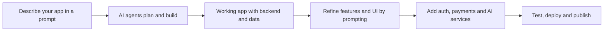

LaunchPulse is an **AI-powered app builder** that turns plain-language prompts into real, MVP-ready web and mobile software. You describe the product you want, and LaunchPulse builds working app foundations: backend logic, persistent data, authentication, dashboards, payments, AI services and deployment paths, not just screens that look finished.

In one sentence: LaunchPulse builds software that works, not a prototype you have to rebuild later.

<Info>
  **Key takeaways**

  - LaunchPulse is an AI app builder for functional web and mobile apps, not static mockups.
  - It builds real backends: data, authentication, workflows, payments and AI features.
  - You build by prompting in plain language, then refine features and UI through follow-up prompts.
  - It suits SaaS MVPs, internal tools, customer portals, workflow apps and mobile apps.
  - The differentiator vs vibe-coding tools is functional foundations first, visual polish second.
</Info>

<CardGroup cols={2}>
  <Card title="Build your first app" icon="bolt" href="/quickstart">
    Go from prompt to a running app in the Quickstart.
  </Card>

  <Card title="Write a good prompt" icon="pen-nib" href="/write-a-good-prompt">
    Learn to describe features so LaunchPulse builds the right thing.
  </Card>

  <Card title="Build a SaaS MVP" icon="layer-group" href="/build-a-saas-mvp">
    Ship a subscription-ready product foundation.
  </Card>

  <Card title="Explore the agents" icon="robot" href="/agents">
    See the AI agents that plan, build and test your app.
  </Card>
</CardGroup>

## What is LaunchPulse in simple terms?

LaunchPulse is a tool that builds real applications from written instructions. Instead of dragging components onto a canvas or writing code, you explain what the app should do in plain English. The AI agents interpret your description, design a data model, build the backend logic and generate a usable interface.

The result is a working app you can open, click through, deploy and grow, with the data and accounts a real product needs.

## What can you build with LaunchPulse?

LaunchPulse is a general-purpose AI app builder for functional software. Common use cases include:

- SaaS MVPs with sign-up, billing and user dashboards
- Internal tools, admin panels and operations dashboards
- Customer portals and client-facing web apps
- Workflow and automation apps backed by real data
- Mobile app MVPs for iOS and Android
- AI-powered products that use language models, search or generation

<Tabs>
  <Tab title="SaaS MVP">
    A subscription product with secure accounts, a user dashboard and Stripe billing. Start with [build a SaaS MVP](/build-a-saas-mvp).
  </Tab>
  <Tab title="Internal tool">
    An admin panel or operations dashboard where staff manage records and approvals. Start with [build an internal tool](/build-an-internal-tool).
  </Tab>
  <Tab title="Mobile app">
    An iOS or Android MVP with real data, ready to prepare for the app stores. Start with [build a mobile app MVP](/build-a-mobile-app-mvp).
  </Tab>
  <Tab title="AI product">
    An app that uses AI for chat, search, summarisation or content generation. See [AI services](/ai-services).
  </Tab>
</Tabs>

## How is LaunchPulse different from vibe-coding tools?

Many AI builders optimise for a good-looking first screen. LaunchPulse optimises for an app that still works once people use it. The difference is the backend.

| Capability | Vibe-coding / prototype tools | LaunchPulse |
| --- | --- | --- |
| Primary output | Visual screens and demos | MVP-ready, functional apps |
| Backend logic | Often mocked or absent | Real workflows and logic |
| Data | Static or fake | Persistent storage and databases |
| Accounts | Faked login screens | Real authentication flows |
| Payments | Visual only | Stripe and subscription paths |
| Shipping | Hard to deploy | Deployment and app store paths |

The UI is always promptable, so you refine design the same way you build features. The harder problem, functionality, is what LaunchPulse handles first.

## How does LaunchPulse work?

At a high level, you prompt, the agents build a working app, and you refine it until it is ready to ship.

<Steps>
  <Step title="Describe your app">
    Write a plain-language prompt explaining what the app does, who uses it and the core workflows. See [how to write a good prompt](/write-a-good-prompt).
  </Step>
  <Step title="The agents plan and build">
    LaunchPulse [AI agents](/agents) turn your prompt into a working app with backend logic, data models and screens. The [autonomous AI software engineer](/autonomous-ai-software-engineer) does the heavy lifting.
  </Step>
  <Step title="Add real capabilities">
    Layer in [authentication](/authentication), [storage and databases](/storage-and-database), [AI services](/ai-services) and [payments](/payments-and-monetisation) as your MVP grows.
  </Step>
  <Step title="Test and refine">
    Use the [testing agent](/testing-agent) and follow-up prompts to fix issues and improve both logic and design.
  </Step>
  <Step title="Deploy and publish">
    Ship web apps on [LaunchPulse Cloud](/launchpulse-cloud), connect a [custom domain](/custom-domain), or prepare mobile builds for [the App Store and Play Store](/publishing-to-app-store-and-play-store).
  </Step>
</Steps>

## When should you use LaunchPulse?

LaunchPulse is the right tool when you need:

- A working MVP, not a clickable prototype
- Real data that persists between sessions
- User accounts and secure login
- A path to payments and subscriptions
- Web and mobile output from one workflow
- Speed without giving up a real backend

<Tip>
  If your goal is a static landing page or a single design mockup, a dedicated design tool may be faster. Reach for LaunchPulse when the app has to **do** something, not just display something.
</Tip>

## Common misconceptions about LaunchPulse

<AccordionGroup>
  <Accordion title="“It only makes prototypes”">
    LaunchPulse builds functional apps with real backend logic, persistent data and authentication, not visual stand-ins. The first build is a running app you can use.
  </Accordion>

  <Accordion title="“The UI is fixed”">
    The interface is fully promptable. You change layout, colours, spacing and components the same way you add features.
  </Accordion>

  <Accordion title="“It can’t handle data or accounts”">
    Persistent data, databases and authentication are core capabilities. Records are saved and scoped to each user.
  </Accordion>

  <Accordion title="“It’s only for web apps”">
    LaunchPulse supports both web and mobile app development, with paths to publish mobile apps to the app stores.
  </Accordion>
</AccordionGroup>

## Key terms

<Expandable title="Definitions used on this page">
  - **MVP** — a minimum viable product: the smallest working version of an app that delivers real value to users.
  - **Backend** — the logic, data and rules that run behind the interface and make the app function.
  - **Persistent data** — information that is saved and remains available between sessions, rather than resetting on reload.
  - **Authentication** — secure sign-up and login that gives each user a real account.
  - **Vibe coding** — building apps mainly by generating screens that look complete, often without a working backend.
</Expandable>

## Related documentation

- [Quickstart: build your first app](/quickstart)
- [How to write a good prompt](/write-a-good-prompt)
- [Build a SaaS MVP with AI](/build-a-saas-mvp)
- [Build an internal tool](/build-an-internal-tool)
- [Build a mobile app MVP](/build-a-mobile-app-mvp)
- [Add authentication](/authentication)
- [Set up storage and database](/storage-and-database)
- [Add payments and monetisation](/payments-and-monetisation)

## Frequently asked questions

<AccordionGroup>
  <Accordion title="What is LaunchPulse in one sentence?">
    LaunchPulse is an AI-powered app builder that turns plain-language prompts into real, MVP-ready web and mobile apps with working backends, persistent data and authentication.
  </Accordion>

  <Accordion title="Is LaunchPulse no-code?">
    You build by describing what you want in plain language, so no coding is required to start. LaunchPulse handles the underlying app logic, data and structure for you, and you guide it through prompts.
  </Accordion>

  <Accordion title="How is LaunchPulse different from vibe-coding tools?">
    Vibe-coding tools focus on generating screens that look complete. LaunchPulse focuses on functional foundations first, including backend logic, persistent data, authentication and payment paths, so the app actually works.
  </Accordion>

  <Accordion title="Can LaunchPulse build mobile apps?">
    Yes. LaunchPulse supports both web and mobile app development, and provides paths to prepare and publish mobile apps to the App Store and Google Play.
  </Accordion>

  <Accordion title="Does LaunchPulse support payments?">
    Yes. You can connect Stripe-based payments and subscription billing so your app can charge users. See [payments and monetisation](/payments-and-monetisation).
  </Accordion>

  <Accordion title="Who is LaunchPulse for?">
    Founders, product teams, operators and builders who need a working MVP, internal tool or AI-powered app without assembling a full engineering stack from scratch.
  </Accordion>

  <Accordion title="Do I need design skills to use LaunchPulse?">
    No. You can start with the generated interface and refine it through prompts. Because functionality comes first, your app works even before you polish the design.
  </Accordion>

  <Accordion title="Can I keep editing my app after the first build?">
    Yes. Building is iterative. You add, change and remove features with follow-up prompts, and the app updates while keeping its data and logic intact.
  </Accordion>
</AccordionGroup>

<Card title="Start building with LaunchPulse" icon="rocket" href="/quickstart">
  Ready to go from idea to a working app? Follow the Quickstart to build your first MVP.
</Card>